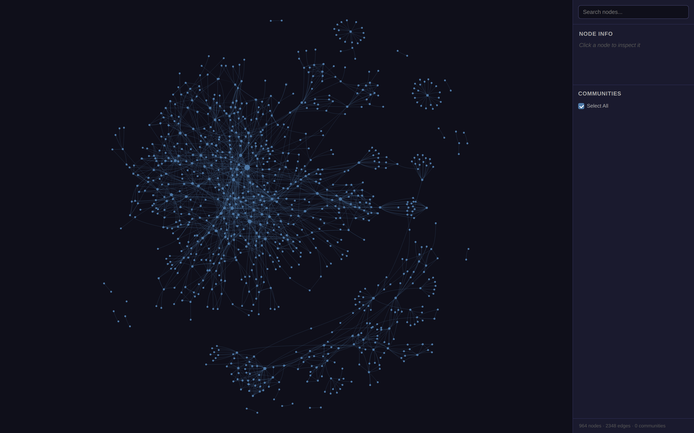

# second-brain — an agentic coding skill

[](https://github.com/PB811/second-brain-skill/actions/workflows/ci.yml) [](LICENSE)

Turn **any codebase** into a private, reproducible **Obsidian "second brain"** — a generated
vault backed by two code-graph substrates:

- **[Graphify](https://pypi.org/project/graphifyy/) local graph** (`graphifyy`) — tree-sitter across ~36 languages, exported as Obsidian notes + Canvas + HTML. *The graph you look at.*
- **[CBM](https://github.com/DeusData/codebase-memory-mcp)** (`codebase-memory-mcp`) — an MCP the agent queries live for call-chains, data-flow, impact. *The graph the assistant thinks with.*

…plus a lean, agent-authored **knowledge layer** (flows, ADRs, runbooks, glossary) that carries
the *meaning* on top of the structure.

> **The model:** a committed *recipe* (a stdlib-only builder + templates + sanitized knowledge)
> generates a gitignored *vault*. It's **"docker compose for a second brain"** — any dev or agent
> runs one command and reproduces the same brain.



> **Agent-agnostic.** This is a skill any agentic coding tool that reads skills can run.
> Install examples use the `~/.claude/skills/` directory — point it at whatever skills
> directory your agent uses.

## Install

**One-liner (uv, no manual install):**
```bash
uvx --from git+https://github.com/PB811/second-brain-skill second-brain install
```
**Or clone it directly:**
```bash
git clone https://github.com/PB811/second-brain-skill ~/.claude/skills/second-brain
```
(or unzip a release into `~/.claude/skills/`). Then, in **any repo**, tell your AI coding agent:

> "build a second brain for this repo"  (or `/second-brain`)

It explains the graphs, scaffolds `second-brain/`, wires **both** substrates (installing CBM +
Graphify if missing), authors starter notes from the graph, builds the vault, and explains the
graphs again. Open `second-brain/vault/` in Obsidian → start at `00-Home`.

## Requirements
- **Python 3.10+ and [`uv`](https://docs.astral.sh/uv/)** on the machine — that's the tool
  runtime (Graphify installs via `uv tool install graphifyy`). The **analyzed project can be any
  language** (Java, Go, TS, Rust, …).
- **CBM** (`codebase-memory-mcp`) is auto-installed + registered by the skill; it's an MCP server,
  so restart your agent once after a fresh install.
- **Obsidian** to browse the vault (optional plugins: Local REST API MCP, Smart Connections, Copilot).

## What makes it different
Most "chat with your repo" tools (DeepWiki, Zread, Google Code Wiki, …) are **hosted** — you send
your code to their cloud and get a wiki you don't own. This is the opposite:

- **Local + private by default** — Graphify's code-only extract is zero-egress and auto-skips `.env`;
  the vault is gitignored and lives on your machine. Safe for proprietary code.
- **Two complementary substrates, not one** — a *visual* graph (Graphify) **and** a *queryable* graph
  (CBM), with the skill explaining when each helps.
- **Reproducible & committable** — the recipe is in git; the vault regenerates deterministically.
  A teammate clones and rebuilds the *same* brain. No service, no lock-in.
- **You own the output** — plain Markdown + Obsidian graph/canvas, editable and offline.
- **Packaged as a reusable skill** — works on any repo, always explains the graphs at start & end.

Trade-off: no hosted zero-install web UI, and the base build is intentionally lean rather than an
auto-generated deep wiki. See [`ROADMAP`](#roadmap).

## Structure
```
SKILL.md                     # the workflow Claude follows (7 steps)
scripts/
  build_brain.py             # deterministic vault builder (stdlib only)
  graphify_refresh.sh        # on-demand local code-graph rebuild
  install_cbm.sh             # install + register CBM (MCP)
  graph_sources/             # cbm.py + graphify.py adapters
assets/                      # brain.config template, note templates, gitignore, README/AGENTS
references/                  # graph-explainer.md, knowledge-authoring.md, deep-wiki-mode.md
second_brain_cli/            # the uvx/pip installer entry point
pyproject.toml               # packaging (enables `uvx … second-brain install`)
```

## Modes
- **Lean (default)** — a dozen high-value curated notes over the exhaustive Graphify graph.
- **Deep wiki** — ask for a "deep wiki" and it authors a DeepWiki-style multi-page set (one
  page per subsystem) under `knowledge/wiki/`. See `references/deep-wiki-mode.md`.

## Roadmap
- Publish to PyPI/npm for the shortest command (`uvx second-brain-skill` / `npx …`).
- Auto-refresh on `git push` (Graphify `hook install`).
- Multi-repo / org graph (Graphify `global`).

## License
MIT © Prathamesh Bheemanathi.
