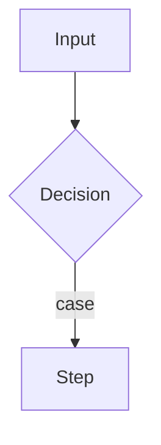

# <Flow name> Flow

> One-line summary: what goes in, what comes out.

**Trigger:** <queue / HTTP route / CLI>
**Entrypoint:** `qualified.name` (`file:line`)
**Output:** <where the result goes>

## Diagram

## Steps
| # | Step | Code (`qualified_name`) | Notes |
| --- | --- | --- | --- |
| 1 |  |  |  |

## Decision points
- **<a branch>:** condition → route. See [[decisions/...]].

## Related
- [[architecture/overview]]
